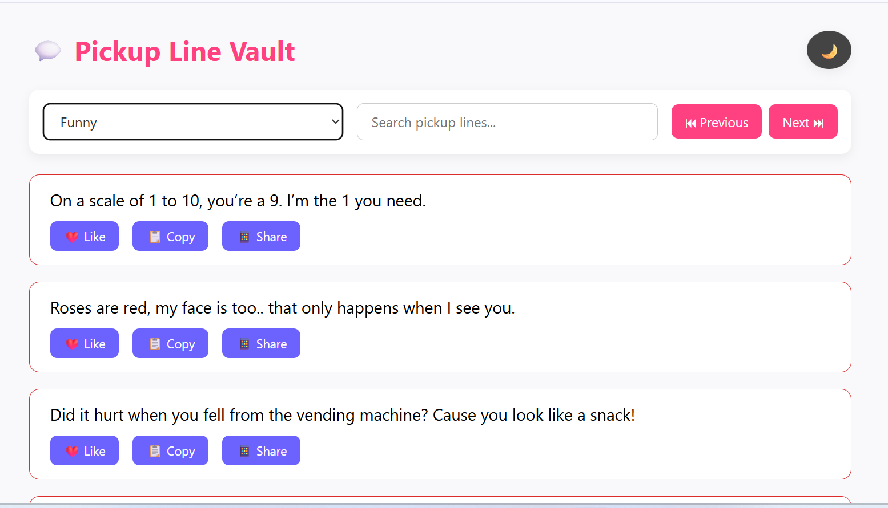
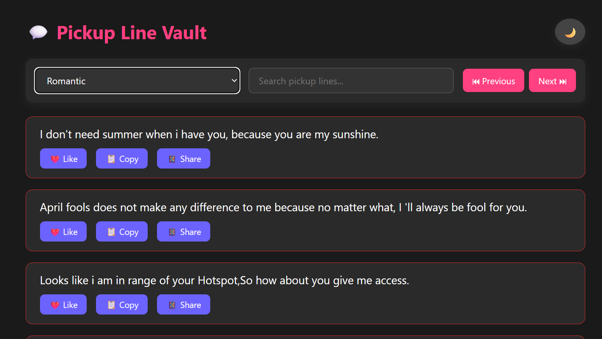

# 💬 Pickup Line Vault

A fun, responsive web app to browse, search, and filter pickup lines by category — with dark mode, pagination, likes, copy, and share features. Built with HTML, CSS, JavaScript, and a Node.js/Express backend.

---

## ✨ Features

- 🔍 Filter pickup lines by category or keyword
- 🌙 Light/Dark mode toggle
- ❤️ Like and locally store liked pickup lines
- 📋 Copy to clipboard functionality
- 📱 Share link support (Web Share API or fallback)
- ⏮ Pagination with Previous/Next buttons
- 🧠 Clean, accessible UI with semantic HTML
- 🔒 Sensitive info like `.env` excluded via `.gitignore`

---

## 📦 Tech Stack

- **Frontend:** HTML5, CSS3, JavaScript (Vanilla)
- **Backend:** Node.js, Express.js, MySQL
- **Storage:** MySQL Database (pickup lines table)
- **API Endpoint:** `GET /api/pickuplines?page=1&limit=10&category=Cute`

---

## 🚀 Getting Started

### 1. Clone the repository

```bash
git clone https://github.com/BISHOW03/pickup-line-vault.git
cd pickup-line-vault
```

### 2. Install backend dependencies
```bash
npm install
```
### 3. Create .env file
```bash
DB_HOST=localhost
DB_USER=your_mysql_user
DB_PASSWORD=your_mysql_password
DB_NAME=your_database_name
PORT=3000
```

### 4. Start the backend server
```bash 
node server.js
Or
npm start
```
### 5. Open in browser
```bash
Visit: http://localhost:3000
```

## 🗃 Project Structure

- pickup-line-vault/
- ├── public/
- │   ├── index.html       # Frontend HTML
- │   ├── styles.css       # CSS styles
- │   └── script.js        # Frontend JS
- ├── .env                 # Environment variables (not pushed)
- ├── .gitignore
- ├── index.js             # Express.js backend server
- ├── db.js                # MySQL DB connection config
- ├── routes/
- │   └── pickuplines.js   # API routes
- └── README.md
## 📸 Screenshots
- 

- 

## 🛡 Security Notes
.env and node_modules/ are excluded via .gitignore

## 📄 License
This project is open-source and free to use under the MIT License.

## 🤝 Contributions
Pull requests are welcome! Feel free to submit ideas, improvements, or pickup lines 💘

## 🙋‍♂️ Author
- Name: Bishow Ghimire
- Location: Butwal, Nepal
